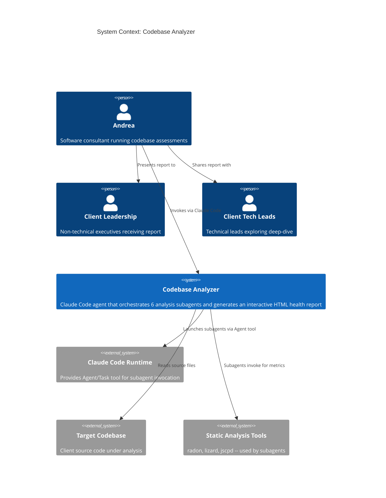
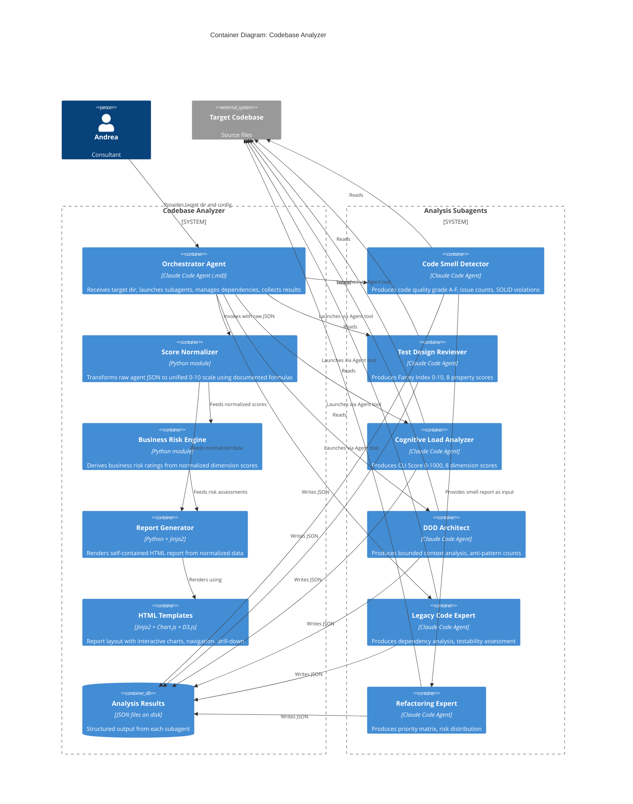
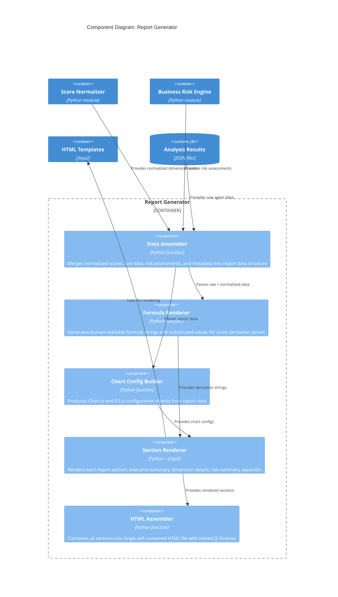

# Codebase Analyzer -- Architecture Document

## 1. System Overview

A Claude Code orchestrator agent that launches 6 specialized analysis subagents against a target codebase, collects structured JSON results, normalizes scores to a unified 0-10 scale, and generates a self-contained HTML report with interactive visualizations. The report serves as a consulting weapon: undeniable, evidence-based, denial-proof.

**Primary User**: Andrea (consultant) -- invokes from Claude Code
**Secondary Users**: Client leadership (executive summary), client technical leads (deep-dive)

---

## 2. C4 System Context (L1)



---

## 3. C4 Container (L2)



---

## 4. C4 Component (L3) -- Report Generator

The report generator is the most complex container (5+ internal concerns). Other containers are simple enough that L2 suffices.



---

## 5. Component Architecture

### 5.1 Orchestrator Agent (Claude Code Agent)

**Responsibility**: Entry point. Accepts target directory and configuration from Andrea via natural language or structured prompt. Validates target, launches subagents, manages agent dependency graph, handles failures, invokes Python pipeline for normalization and report generation.

**Boundary**: Agent markdown file + prompt logic. No Python code in this component -- it delegates all computation to Python modules.

**Agent Dependency Graph**:
```
Parallel Group:  [smell] [test] [cognitive] [ddd] [legacy]
Sequential:      [smell] --> [refactor]
```

Five agents run in parallel. Refactoring agent starts only after code smell detector completes (it needs the smell report as input).

**Failure Handling**: If a subagent fails or times out, the orchestrator records the failure, marks that dimension as "Not Available", and continues with remaining agents. The report adapts to missing dimensions.

### 5.2 Score Normalizer (Python Module)

**Responsibility**: Transform diverse raw agent outputs into a unified 0-10 scale. Every formula is documented and reproducible.

**Port**: Accepts raw agent JSON, returns normalized dimension scores.

**Normalization Formulas** (see ADR-002 for rationale):

| Agent | Raw Metric | Formula | Range |
|-------|-----------|---------|-------|
| code-smell-detector | Grade A-F | `{A:10, B:8, C:6, D:4, F:2}` | 0-10 |
| test-design-reviewer | Farley Index 0-10 | Direct passthrough | 0-10 |
| cognitive-load-analyzer | CLI Score 0-1000 | `max(0, min(10, 10 - score/100))` | 0-10 |
| ddd-architect | Anti-pattern count + compliance signals | LLM-assessed score embedded in agent JSON | 0-10 |
| legacy-code-expert | Dependency density + seam availability | LLM-assessed score embedded in agent JSON | 0-10 |
| refactoring-expert | Weighted recommendation count | `max(0, 10 - weighted_count / threshold)` | 0-10 |

**Overall Health Score**: Weighted average scaled to 0-100:
```
health = (code_quality * 0.20 + test_design * 0.20 + cognitive_load * 0.20
          + ddd_compliance * 0.15 + legacy_safety * 0.15 + refactoring_debt * 0.10) * 10
```

**Rating Thresholds**: 0-40 Critical | 41-60 Needs Attention | 61-80 Good | 81-100 Excellent

### 5.3 Business Risk Engine (Python Module)

**Responsibility**: Derive business risk categories from normalized dimension scores.

**Port**: Accepts normalized dimension scores, returns risk assessments per category.

**Risk Model**:

| Risk Category | Contributing Dimensions | HIGH Threshold | MODERATE Threshold |
|--------------|------------------------|----------------|-------------------|
| Delivery Velocity | refactoring_debt (0.5) + cognitive_load (0.3) + code_quality (0.2) | weighted < 4.0 | weighted < 6.0 |
| Incident | legacy_safety (0.4) + test_design (0.3) + code_quality (0.3) | weighted < 4.0 | weighted < 6.0 |
| Onboarding | cognitive_load (0.5) + code_quality (0.3) + ddd_compliance (0.2) | weighted < 4.0 | weighted < 6.0 |

Anything above MODERATE threshold = LOW risk.

### 5.4 Report Generator (Python + Jinja2)

**Responsibility**: Produce a single self-contained HTML file with all data, charts, and navigation embedded.

**Port**: Accepts assembled report data (normalized scores, raw data, risk assessments, metadata), returns HTML string written to output path.

**Report Sections**:
1. Executive Summary -- overall score gauge, 6-axis radar, dimension bars, weakest dimension callout
2. Business Risk Summary -- 3 risk categories with severity and description
3. Per-Dimension Details (6 sections) -- dimension-specific charts, findings tables, score derivation panels
4. Methodology Appendix -- normalization formulas, risk model, weight rationale

**Visualization Stack**:
- Chart.js v4 -- radar, doughnut/gauge, bar, scatter (80% of charts)
- D3.js v7 -- heatmaps, treemaps (20% of charts)
- Mermaid.js -- bounded context diagrams from DDD agent
- All libraries inlined in the HTML file (offline-first, ~3MB total)

### 5.5 HTML Templates (Jinja2)

**Responsibility**: Define report layout, chart configurations, navigation, print CSS.

**Structure**:
- `base.html` -- HTML skeleton, inlined JS/CSS libraries, navigation bar
- `executive_summary.html` -- overall score, radar, dimension bars, risk summary
- `dimension_detail.html` -- reusable template per dimension (chart configs vary)
- `score_derivation.html` -- formula display, raw data, explanation
- `appendix.html` -- methodology, formulas, limitations

### 5.6 Agent JSON Output Contract

Each subagent must produce a structured JSON block alongside its markdown report. This is the integration contract between agents and the normalizer.

**Delivery mechanism**: Each agent writes a `{agent-name}-data.json` file in the analysis output directory.

**Contract schemas** are defined per agent in `docs/feature/codebase-analyzer/design/agent-contracts/`. See section 8 for the summary.

---

## 6. Technology Stack

| Component | Technology | Version | License | Rationale |
|-----------|-----------|---------|---------|-----------|
| Orchestrator | Claude Code Agent | current | Proprietary (Anthropic) | User requirement -- agent invocation via Claude Code |
| Python runtime | Python | 3.11+ | PSF (OSS) | Team expertise, Jinja2/data processing ecosystem |
| Template engine | Jinja2 | 3.1+ | BSD-3-Clause | Standard Python HTML templating, rich filter system |
| Chart library (primary) | Chart.js | 4.x | MIT | Radar, bar, doughnut, scatter -- covers 80% of charts |
| Chart library (secondary) | D3.js | 7.x | ISC | Heatmaps, treemaps -- flexibility for complex viz |
| Diagram library | Mermaid.js | 10.x | MIT | Declarative syntax for bounded context maps |
| CSS framework | None (custom) | -- | -- | Minimal CSS avoids framework bloat in single-file report |
| Data validation | Pydantic | 2.x | MIT | Dataclass-compatible, validates agent JSON contracts |
| Package management | uv | latest | MIT/Apache-2.0 | Fast, modern Python package management |

**Rejected alternatives**: See ADR-001 through ADR-005.

---

## 7. Integration Patterns

### 7.1 Orchestrator-to-Subagent

- **Mechanism**: Claude Code Agent tool (subagent invocation)
- **Direction**: Orchestrator launches each subagent with target directory path and analysis instructions
- **Data flow**: Subagent reads codebase, writes `{agent-name}-data.json` to output directory
- **Timeout**: Configurable per agent (default 10 minutes)
- **Failure**: Orchestrator catches timeout/error, marks dimension as unavailable, continues

### 7.2 Subagent-to-Subagent Dependency

- **refactoring-expert depends on code-smell-detector**: The refactoring agent reads the smell detector's markdown report as input
- **Enforcement**: Orchestrator launches refactoring agent only after smell detector completes successfully
- **Failure cascade**: If smell detector fails, refactoring agent is skipped (both marked unavailable)

### 7.3 Agent Results to Python Pipeline

- **Mechanism**: Orchestrator invokes Python scripts via Bash tool after all agents complete
- **Data flow**: Python reads JSON files from output directory, runs normalization pipeline, writes HTML report
- **Single invocation**: One Python entry point handles normalize -> risk -> render -> write

### 7.4 Report Data Embedding

- **All data embedded**: Report data is serialized as `const reportData = {...}` in a `<script>` tag
- **No external fetching**: Report is fully self-contained -- no API calls, no CDN dependencies
- **JS libraries inlined**: Chart.js, D3.js, Mermaid.js source inlined in `<script>` tags

---

## 8. Agent JSON Output Contracts (Summary)

Each agent must produce a JSON file conforming to these schemas. Full schemas in `docs/feature/codebase-analyzer/design/agent-contracts/`.

### code-smell-detector-data.json
```
grade: str (A|B|C|D|F)
total_issues: int
severity_distribution: {high: int, medium: int, low: int}
category_distribution: {category_name: int, ...}
solid_compliance: {SRP: float, OCP: float, LSP: float, ISP: float, DIP: float}
top_issues: [{file: str, issue: str, severity: str, category: str}, ...]
```

### test-design-reviewer-data.json
```
farley_index: float (0-10)
rating: str
properties: {property_name: {static: float, llm: float, blended: float}, ...}
tautology_counts: {mock_tautology: int, mock_only: int, trivial: int, framework: int}
worst_offenders: [{file: str, score: float, issues: [str]}, ...]
```

### cognitive-load-analyzer-data.json
```
cli_score: int (0-1000)
rating: str
dimensions: {D1_name: {raw: str, normalized: float, weighted: float}, ...}
interaction_penalty: float
worst_offenders: [{file: str, score: float, primary_dimension: str}, ...]
```

### ddd-architect-data.json
```
overall_score: float (0-10)
bounded_context_count: int
subdomain_distribution: {core: int, supporting: int, generic: int}
anti_patterns: [{name: str, severity: str, location: str}, ...]
pattern_maturity: {strategic: float, tactical: float, language: float, boundaries: float, events: float}
context_map_mermaid: str
```

### legacy-code-expert-data.json
```
overall_score: float (0-10)
risk_level: str (Low|Medium|High|Critical)
dependency_count: int
testability_score: float (0-1)
seam_availability: {object: int, link: int, preprocessing: int}
modules_at_risk: [{file: str, risk: str, dependencies: int, seams: int}, ...]
```

### refactoring-expert-data.json
```
total_recommendations: int
priority_matrix: [{item: str, impact: str, complexity: str, risk: str}, ...]
risk_distribution: {low: int, medium: int, high: int}
category_distribution: {category_name: int, ...}
implementation_sequence: [{order: int, item: str, rationale: str}, ...]
```

---

## 9. Quality Attribute Strategies

### 9.1 Maintainability
- Functional-first Python: pure functions, composition pipelines, dataclasses for data, protocols for port boundaries
- Each concern is a separate module: normalization, risk, rendering, data assembly
- Agent JSON contracts are validated via Pydantic models -- schema drift caught early

### 9.2 Testability
- Pure normalizer functions: input JSON -> output scores. No side effects. Trivially testable.
- Risk engine: input scores -> output risk ratings. Pure function.
- Report generator: input data -> output HTML string. Verifiable via snapshot tests.
- Agent JSON contracts: validated independently of agent execution.

### 9.3 Reliability
- Agent failure isolation: one agent failure does not kill the run
- Partial report generation: report adapts to available dimensions
- JSON contract validation: malformed agent output caught before normalization
- Score consistency: single source of truth for formulas; displayed formula = code formula

### 9.4 Usability (Report)
- Executive summary fits one screen (1920x1080)
- 4-level drill-down: summary -> dimension -> derivation -> file-level evidence
- Sticky navigation bar for presentation mode
- Print CSS for PDF handouts
- Collapsible sections for progressive disclosure

### 9.5 Performance
- Agent parallelization: 5 of 6 agents run concurrently
- Report generation is a single Python invocation (seconds, not minutes)
- HTML file ~3MB with inlined libraries -- loads instantly from local filesystem

### 9.6 Portability
- Report is a single HTML file -- works on any OS, any modern browser
- No server required, no installation for report viewers
- Python modules use standard library + Jinja2 + Pydantic (minimal dependencies)

---

## 10. Data Flow

```
Andrea invokes orchestrator agent in Claude Code
    |
    v
Orchestrator validates target directory
    |
    v
Orchestrator launches 5 parallel subagents + 1 sequential
    |                                              |
    v                                              v
[smell] [test] [cognitive] [ddd] [legacy]    [smell] --> [refactor]
    |       |       |        |       |                      |
    v       v       v        v       v                      v
Each agent writes {name}-data.json to output directory
    |
    v
Orchestrator invokes Python pipeline via Bash:
    |
    +-> Score Normalizer: reads all JSON, applies formulas -> normalized scores
    |
    +-> Business Risk Engine: derives risk categories from scores -> risk assessments
    |
    +-> Report Generator: assembles data + renders Jinja2 templates -> HTML string
    |
    +-> Writes HTML to output path
    |
    v
Orchestrator reports completion with summary scores
```

---

## 11. File Structure (Production)

```
codebase-analyzer/
  codebase-analyzer.md              # Orchestrator agent definition
  src/
    report/
      __init__.py
      pipeline.py                   # Entry point: orchestrates normalize -> risk -> render
      normalize.py                  # Score normalization functions (pure)
      risk.py                       # Business risk derivation functions (pure)
      render.py                     # HTML assembly and file writing
      formulas.py                   # Formula rendering for derivation panels (pure)
      charts.py                     # Chart.js/D3.js config builders (pure)
      models.py                     # Pydantic models for agent contracts + report data
    templates/
      base.html                     # HTML skeleton with inlined JS/CSS
      executive_summary.html        # Overall score, radar, risk summary
      dimension_detail.html         # Per-dimension section (parameterized)
      score_derivation.html         # Formula + raw data display
      appendix.html                 # Methodology section
    assets/
      chart.min.js                  # Chart.js v4 (inlined at build time)
      d3.min.js                     # D3.js v7 (inlined at build time)
      mermaid.min.js                # Mermaid.js v10 (inlined at build time)
  tests/
    unit/
      test_normalize.py
      test_risk.py
      test_formulas.py
      test_charts.py
      test_models.py
    integration/
      test_pipeline.py
      test_render.py
  pyproject.toml
```

Estimated production files: ~12 Python + ~5 templates = ~17 files.

---

## 12. Deployment Architecture

This is a local development tool, not a deployed service.

- **Installation**: Clone repo, `uv sync` to install dependencies
- **Agent installation**: Copy `codebase-analyzer.md` to `~/.claude/agents/` (or reference via path)
- **Subagent prerequisite**: The 6 analysis agents must be installed in Claude Code's agent path
- **Invocation**: Andrea opens Claude Code and invokes the orchestrator agent
- **Output**: Single HTML file written to specified path

---

## 13. Architectural Constraints for Implementation

These constraints guide the software crafter during implementation:

1. **Functional-first**: Pure functions for all computation (normalize, risk, formulas, charts). Side effects (file I/O, agent invocation) at boundaries only. Composition over inheritance.
2. **Dataclasses for data**: All data structures as frozen dataclasses or Pydantic models. No mutable state in the pipeline.
3. **Protocols for ports**: Agent output contracts defined as Protocols. Normalizer port defined as Protocol. No ABC inheritance chains.
4. **Single HTML output**: Report must be one file with all resources inlined. No external dependencies at report-view time.
5. **Score reproducibility**: Every displayed score must be reproducible from displayed formula + displayed raw data. Rounding at display time only.
6. **Graceful degradation**: Missing agent results reduce report scope but never break report generation. Radar chart adapts to available axes. Overall score recalculates with adjusted weights.

---

## 14. Dependency on Agent Modifications

The 6 analysis agents at `~/.claude/agents/` must be modified to produce structured JSON output files alongside their existing markdown reports. This is a prerequisite for the analyzer to function.

**Required changes per agent**:
- Add instruction to write a `{agent-name}-data.json` file to the analysis output directory
- JSON must conform to the contract schema defined in section 8
- Existing markdown report output is unchanged

**Agents to modify**:
1. `code-smell-detector/code-smell-detector.md`
2. `test-design-reviewer/test-design-reviewer.md`
3. `cognitive-load-analyzer/cognitive-load-analyzer.md`
4. `domain-driven-design/ddd-architect-agent.md`
5. `legacy-code-expert/legacy-code-expert.md`
6. `refactoring-expert/refactoring-expert.md`

This work is outside the codebase-analyzer repository but is an architectural dependency.
